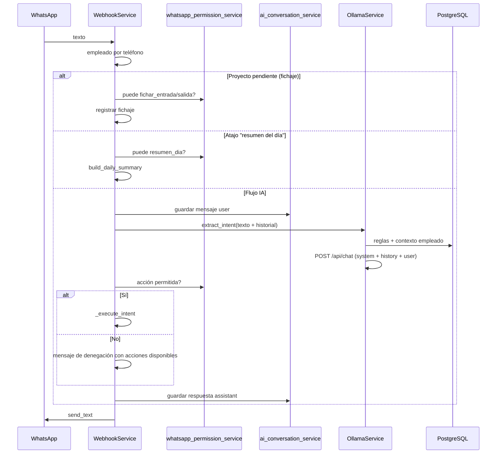

# Arquitectura IA y WhatsApp — HRM

Este documento describe cómo el sistema interpreta mensajes de WhatsApp, qué permisos aplican y cómo se usa el historial de conversación con Ollama.

## Resumen

| Capa | Responsabilidad |
|------|-----------------|
| **goWA / Webhook** | Recibe mensajes, identifica empleado por teléfono |
| **Permisos WhatsApp** | Matriz IA (perfil) + RBAC (grupos del empleado) |
| **Ollama** | Clasifica intención en JSON a partir del texto + contexto |
| **Reglas conversacionales** | Texto extra en el prompt (plataforma `/admin/ia`) |
| **Historial** | Últimos mensajes user/assistant en `ai_whatsapp_messages` |
| **Ejecución** | Servicios de fichajes, paradas, vacaciones, documentos |

## Flujo de un mensaje de texto



## Permisos: doble comprobación

Una acción por WhatsApp solo se ejecuta si pasan **las dos** capas (salvo empleados sin ningún permiso de grupo: entonces solo matriz IA).

### 1. Matriz IA (plataforma)

- Tablas: `ai_actions`, `ai_profile_actions`
- Configuración: **Admin plataforma → IA** (`/admin/ia`)
- Perfiles: `employee`, `manager`, `tenant_admin`, `labor_inspector`
- Código: `ai_config_service.is_action_allowed_for_role()`

Mapeo rol de empleado → perfil IA:

| Rol empleado | Perfil IA |
|--------------|-----------|
| `employee` | `employee` |
| `manager`, `supervisor` | `manager` |
| `admin`, `tenant_admin` | `tenant_admin` |
| `labor_inspector` | `labor_inspector` |

### 2. RBAC (cuenta / grupos)

- Grupos en **Grupos y permisos** del tenant
- Si el empleado pertenece a grupos con permisos, deben incluir el permiso mínimo de la acción
- Código: `whatsapp_permission_service.is_whatsapp_action_allowed()`
- Implementación: `get_employee_permissions()` en `app/core/permissions.py`

| Acción WhatsApp | Permisos RBAC (cualquiera) |
|-----------------|----------------------------|
| `fichar_entrada` / `fichar_salida` | `clock_ins.create_own`, `clock_ins.write` |
| `inicio_parada` / `fin_parada` | `breaks.create_own`, `breaks.write` |
| `solicitar_vacaciones` | `leave.create_own`, `leave.write` |
| `consultar_saldo_vacaciones` | `leave.read_own`, `leave.read` |
| `confirmar_documento` | `documents.read_own`, `documents.write`, `legal.update_own` |
| `resumen_dia` | `clock_ins.read_own`, `clock_ins.read` |

`desconocido` no ejecuta nada; siempre permitido para mostrar ayuda.

### Rutas que también pasan por permisos

| Entrada | Acción comprobada |
|---------|-------------------|
| Texto → Ollama | Según intent detectado |
| Atajo palabras "resumen del día" | `resumen_dia` |
| Ubicación GPS | `fichar_entrada` o `fichar_salida` (según último fichaje) |
| PDF / imagen (alta) | Config `inbound_documents_enabled` + permiso documentos |
| Respuesta selector de proyecto | `fichar_entrada` / `fichar_salida` |

## Catálogo de intenciones

| Código | Ejecución |
|--------|-----------|
| `fichar_entrada` | `ClockService.register_clock` (+ flujo proyecto si aplica) |
| `fichar_salida` | Igual |
| `inicio_parada` / `fin_parada` | `BreakService` |
| `solicitar_vacaciones` | `LeaveService.create_request` (extrae fechas del JSON) |
| `consultar_saldo_vacaciones` | `LeaveService.get_balance_message` |
| `confirmar_documento` | Acuse de documento |
| `resumen_dia` | `build_employee_day_report` (fichajes + paradas) |
| `desconocido` | Lista de acciones permitidas para ese empleado |

Tras fichaje entrada puede generarse **incidencia automática** (reglas en configuración de fichajes).

## Ollama — prompt y contexto

**Servicio:** `app/services/ollama_service.py`

**Mensajes enviados al modelo:**

1. `system` — prompt dinámico (`ai_conversation_service.build_system_prompt`):
   - Datos del empleado y tenant
   - Flags: proyecto obligatorio, resumen día, documentación WhatsApp
   - **Lista cerrada de intenciones permitidas** para ese empleado
   - Reglas base de clasificación
   - Reglas adicionales de `ai_conversation_rules` (prioridad)
2. Hasta **12** mensajes previos (`user` / `assistant`) de `ai_whatsapp_messages`
3. `user` — mensaje actual

**Respuesta esperada (JSON):**

```json
{
  "intent": "fichar_entrada",
  "entities": { "fecha_inicio": "2026-05-22", "motivo": "..." },
  "confidence": 0.85
}
```

**Fallback:** si Ollama falla, `_keyword_fallback()` con palabras clave; el resultado se filtra de nuevo por acciones permitidas.

**Modelo y URL:** por tenant (`tenants.ollama_base_url`, `ollama_model`); fallback en `Settings`.

## Historial de conversación

| Tabla | `ai_whatsapp_messages` |
|-------|-------------------------|
| Campos | `tenant_id`, `employee_id`, `role`, `content`, `intent_code`, `created_at` |
| Límite | 12 mensajes y 7 días por empleado |
| Migración | `scripts/migrate_ai_v2.py` |

**No** se envía a Ollama el historial de otros empleados ni de otros tenants.

## Reglas conversacionales

- Tabla: `ai_conversation_rules`
- Gestión: plataforma `/admin/ia` → pestaña reglas
- Se inyectan en el **system prompt** ordenadas por `priority`
- Ejemplos: tono, sinónimos internos, políticas de la empresa

No sustituyen permisos: si la regla sugiere una acción no permitida, el modelo debería devolver `desconocido` y el backend deniega igualmente.

## Telemetría

`ai_usage_records` guarda por petición: tenant, perfil, `action_code`, tokens, duración, éxito. No es historial conversacional.

## Archivos principales

```
backend/app/services/webhook_service.py       # Orquestación WhatsApp
backend/app/services/whatsapp_permission_service.py
backend/app/services/ollama_service.py
backend/app/services/ai_conversation_service.py
backend/app/services/ai_config_service.py     # Matriz y reglas
backend/app/models/ai.py
backend/app/routers/platform_ai.py
frontend/src/pages/PlatformAIPage.tsx
```

## Configuración recomendada

1. **Plataforma → IA:** activar solo las acciones deseadas por perfil (p. ej. inspector solo consulta saldo).
2. **Grupos del tenant:** alinear permisos `*_own` con lo que debe hacer cada rol por WhatsApp.
3. **Reglas conversacionales:** añadir vocabulario de la empresa y casos especiales.
4. **Ollama:** modelo con salida JSON fiable (`llama3.2` o superior); comprobar conectividad desde el contenedor `backend` al host Ollama.

## Diferencias panel vs WhatsApp

| Aspecto | Panel web | WhatsApp |
|---------|-----------|----------|
| Permisos | Grupos RBAC granulares | Matriz IA + RBAC por acción |
| Config IA | Solo plataforma | — |
| Historial IA | No | `ai_whatsapp_messages` |
| Fichaje | Formulario manual | Texto, ubicación, IA |

Un empleado puede tener permiso en panel pero no en matriz IA (o al revés). La comprobación efectiva es la **intersección** cuando tiene permisos de grupo asignados.
