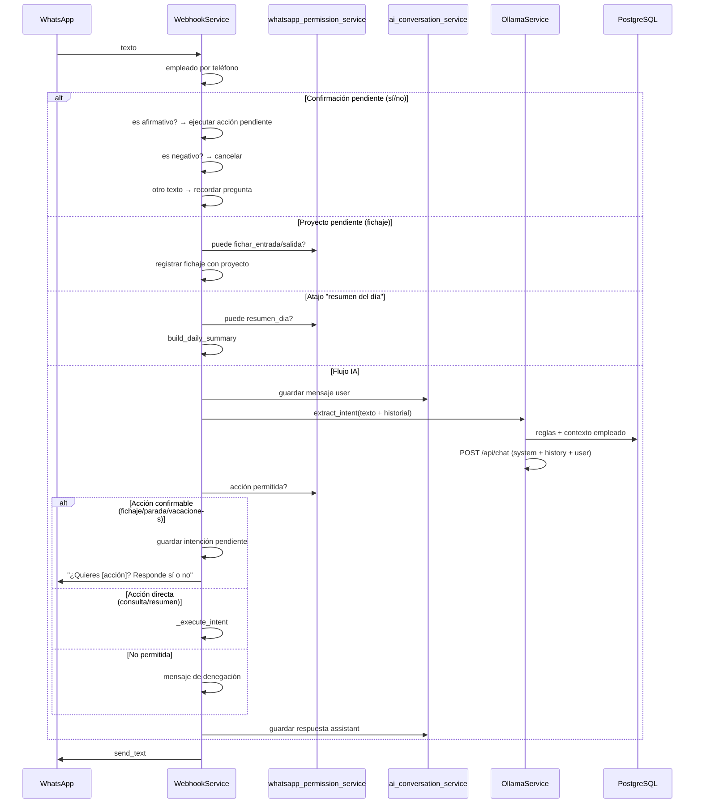

# Arquitectura IA y WhatsApp — HRM

Este documento describe cómo el sistema interpreta mensajes de WhatsApp, qué permisos aplican y cómo se usa el historial de conversación con Ollama.

## Resumen

| Capa | Responsabilidad |
|------|-----------------|
| **goWA / Webhook** | Recibe mensajes, identifica empleado por teléfono |
| **Permisos WhatsApp** | Matriz IA (perfil) + RBAC (grupos del empleado) |
| **Ollama** | Clasifica intención en JSON a partir del texto + contexto |
| **Reglas conversacionales** | Texto extra en el prompt (plataforma `/admin/ia`) |
| **Historial** | Últimos mensajes user/assistant en `ai_whatsapp_messages` |
| **Ejecución** | Servicios de fichajes, paradas, vacaciones, documentos |

## Flujo de un mensaje de texto



## Permisos: doble comprobación

Una acción por WhatsApp solo se ejecuta si pasan **las dos** capas (salvo empleados sin ningún permiso de grupo: entonces solo matriz IA).

### 1. Matriz IA (plataforma)

- Tablas: `ai_actions`, `ai_profile_actions`
- Configuración: **Admin plataforma → IA** (`/admin/ia`)
- Perfiles: `employee`, `manager`, `tenant_admin`, `labor_inspector`
- Código: `ai_config_service.is_action_allowed_for_role()`

Mapeo rol de empleado → perfil IA:

| Rol empleado | Perfil IA |
|--------------|-----------|
| `employee` | `employee` |
| `manager`, `supervisor` | `manager` |
| `admin`, `tenant_admin` | `tenant_admin` |
| `labor_inspector` | `labor_inspector` |

### 2. RBAC (cuenta / grupos)

- Grupos en **Grupos y permisos** del tenant
- Si el empleado pertenece a grupos con permisos, deben incluir el permiso mínimo de la acción
- Código: `whatsapp_permission_service.is_whatsapp_action_allowed()`
- Implementación: `get_employee_permissions()` en `app/core/permissions.py`

| Acción WhatsApp | Permisos RBAC (cualquiera) |
|-----------------|----------------------------|
| `fichar_entrada` / `fichar_salida` | `clock_ins.create_own`, `clock_ins.write` |
| `inicio_parada` / `fin_parada` | `breaks.create_own`, `breaks.write` |
| `solicitar_vacaciones` | `leave.create_own`, `leave.write` |
| `consultar_saldo_vacaciones` | `leave.read_own`, `leave.read` |
| `confirmar_documento` | `documents.read_own`, `documents.write`, `legal.update_own` |
| `resumen_dia` | `clock_ins.read_own`, `clock_ins.read` |

`desconocido` no ejecuta nada; siempre permitido para mostrar ayuda.

### Rutas que también pasan por permisos

| Entrada | Acción comprobada | ¿Confirmación? |
|---------|-------------------|-----------------|
| Texto → Ollama (fichaje/parada/vacaciones) | Según intent detectado | ✅ Sí (sí/no) |
| Texto → Ollama (consulta saldo/resumen) | Según intent detectado | ❌ No (ejecución directa) |
| Atajo palabras "resumen del día" | `resumen_dia` | ❌ No |
| Respuesta sí/no a confirmación | `pending_intent` almacenado | — (ya confirmado) |
| Ubicación GPS | `fichar_entrada` o `fichar_salida` (según último fichaje) | ❌ No (la ubicación es la confirmación) |
| PDF / imagen (alta) | Config `inbound_documents_enabled` + permiso documentos. Si hay varios tipos pendientes, el bot pide *número o nombre* del documento |
| Respuesta selector de proyecto | `fichar_entrada` / `fichar_salida` | ❌ No |

### Confirmación sí/no (nuevo)

Las acciones que modifican estado requieren confirmación explícita del empleado:

1. El bot detecta la intención (ej. "ficho ahora" → `fichar_entrada`)
2. Responde: *"Hola [nombre], entiendo que quieres fichar la entrada, ¿es correcto? Responde sí o no por favor."*
3. Si el empleado responde **sí**/vale/ok/confirmo → ejecuta la acción
4. Si responde **no**/cancelar → descarta la acción
5. Si responde otra cosa → recuerda la pregunta

**Acciones que requieren confirmación:** `fichar_entrada`, `fichar_salida`, `inicio_parada`, `fin_parada`, `solicitar_vacaciones`

**Acciones directas (sin confirmación):** `consultar_saldo_vacaciones`, `resumen_dia`, `confirmar_documento`

## Catálogo de intenciones

| Código | Ejecución | Confirmación |
|--------|-----------|--------------|
| `fichar_entrada` | `ClockService.register_clock` (+ flujo proyecto si aplica). El sistema pregunta sí/no antes de ejecutar. | ✅ |
| `fichar_salida` | Igual. Cierra la jornada abierta. | ✅ |
| `inicio_parada` / `fin_parada` | `BreakService` — asocia la parada al `clock_in_id` del fichaje de ENTRADA abierto. | ✅ |
| `solicitar_vacaciones` | `LeaveService.create_request` (extrae fechas del JSON) | ✅ |
| `consultar_saldo_vacaciones` | `LeaveService.get_balance_message` | ❌ |
| `confirmar_documento` | Acuse de documento | ❌ |
| `resumen_dia` | `build_employee_day_report` (fichajes + paradas) | ❌ |
| `desconocido` | Lista de acciones permitidas para ese empleado | ❌ |

## Justificación de incidencias por WhatsApp

Las incidencias marcadas con `require_justification=True` (ya sean manuales o automáticas por omisión de fichaje) se pueden justificar directamente desde WhatsApp, sin necesidad de abrir un enlace web.

### Palabra clave `justificar`

El empleado escribe `justificar [texto]` en cualquier momento:

```
justificar Llegué tarde por un retraso en el metro
justificar: No pude fichar la salida porque el móvil se quedó sin batería
```

La regex de detección acepta variantes: `justificar`, `justifica`, `justifícar`, con o sin dos puntos, con o sin espacio.

### Flujo completo

```
Empleado → "justificar [texto]"
         │
         ▼
  _extract_justification_text()   ← detecta la palabra clave
         │
         ├─ ¿0 incidencias pending_justification?
         │    → "No tienes incidencias pendientes de justificación"
         │
         ├─ ¿1 incidencia + texto en el mensaje?
         │    → submit_employee_justification() + add_note()
         │    → "✅ Justificación enviada para: [título incidencia]"
         │
         ├─ ¿1 incidencia + sin texto?
         │    → Guarda pending (awaiting_incident_justification=True)
         │    → "¿Cuál es tu justificación para [título]? Responde con el texto."
         │    → Empleado responde texto → _complete_whatsapp_justification()
         │
         └─ ¿N incidencias (>1)?
              → Lista numerada de todas las incidencias
              → "Responde: justificar 2: tu explicación"
              → Empleado responde con número → se resuelve esa incidencia
```

### Estado pendiente de justificación

Cuando el empleado escribe `justificar` sin texto y tiene una sola incidencia pendiente, se crea un registro en `clock_pending_fichajes` con:

```python
pending_meta = {"awaiting_incident_justification": True, "incident_id": "..."}
```

- **Timeout**: 60 minutos (vs. 3 min para el resto de pendientes de WA)
- El mensaje siguiente del empleado (cualquier texto) se interpreta como la justificación
- El cleanup scheduler respeta este timeout extendido

### Notificación automática de incidencias (schedulers)

El scheduler `_omission_incident_scheduler` (cada 15 min) detecta:
- **Omisión de entrada**: empleado sin fichar N horas después de su hora de inicio (configurable, mínimo 0.5 h)
- **Omisión de salida**: fichaje de entrada abierto hace más de N horas (configurable, mínimo 1 h)

Al crear la incidencia, si `missing_clock_in_notify_whatsapp=True` (o `missing_clock_out_notify_whatsapp=True`), envía por WhatsApp:

```
⚠️ *Incidencia: Omisión de fichaje de entrada*

No se ha registrado fichaje de entrada hoy a las 09:00.

Responde *justificar* seguido de tu explicación para resolverla. Ejemplo:
_justificar Llegué tarde por un retraso del metro_
```

El scheduler `_reminder_scheduler` (cada 5 min) también puede enviar recordatorios periódicos de incidencias pendientes si `incident_reminder_enabled=True` en `ClockSettings`.

### Modelo de fichaje: entrada + salida = una jornada

Un **fichaje** como registro completo se compone de:
- **ENTRADA**: inicia la jornada
- **SALIDA**: cierra la jornada

No son dos fichajes independientes, sino un par entrada-salida que define una jornada laboral.
Las **paradas** (descansos) se asocian automáticamente al fichaje de ENTRADA que está abierto (sin SALIDA aún),
a través del campo `clock_in_id` en `work_breaks`.

Tras fichaje entrada puede generarse **incidencia automática** (reglas en configuración de fichajes).

## Ollama — estrategia conversacional de comprensión

**Servicios:** `ollama_service.py`, `whatsapp_nlu.py`, `ai_conversation_service.py`

### Capas (en orden)

1. **Contexto enriquecido** — El prompt incluye estado de fichaje (último ENTRADA/SALIDA), permisos y reglas de `/admin/ia`.
2. **Ollama (principal)** — Interpreta español coloquial con historial (hasta 12 turnos). Devuelve JSON con `intent`, `entities`, `confidence` y opcionalmente `reply_prefix` (frase humana breve).
3. **Pista NLU** — `whatsapp_nlu.keyword_nlu_hint()` informa al modelo si las reglas detectan algo obvio (no sustituye a Ollama).
4. **Respaldo por reglas** — Si Ollama falla o devuelve `desconocido` con baja confianza, `match_whatsapp_intent()` aplica sinónimos (`ficho ahora`, `me voy`, etc.) usando el mismo criterio de alternancia entrada/salida.

### Mensajes al modelo

1. `system` — prompt dinámico (`build_system_prompt`)
2. Historial previo (sin duplicar el mensaje actual)
3. `user` — mensaje actual

### Respuesta esperada (JSON)

```json
{
  "intent": "fichar_entrada",
  "entities": { "fecha_inicio": "2026-05-22", "motivo": "..." },
  "confidence": 0.85,
  "reply_prefix": "Perfecto, te registro la entrada."
}
```

`reply_prefix` se antepone a la respuesta operativa (fichaje, resumen, etc.). En `desconocido` puede usarse como introducción a la ayuda conversacional.

**Modelo y URL:** por tenant (`tenants.ollama_base_url`, `ollama_model`); fallback en `Settings`.

## Historial de conversación

| Tabla | `ai_whatsapp_messages` |
|-------|-------------------------|
| Campos | `tenant_id`, `employee_id`, `role`, `content`, `intent_code`, `created_at` |
| Límite | 12 mensajes y 7 días por empleado |
| Migración | `scripts/migrate_ai_v2.py` |

**No** se envía a Ollama el historial de otros empleados ni de otros tenants.

El historial ahora incluye:
- Mensajes de usuario (textos originales)
- Respuestas del asistente (confirmaciones, resultados, ayuda)
- Estados intermedios: `pending_confirmation`, `cancelled`, `denied`

## Estado pendiente

| Tabla | `clock_pending_fichajes` |
|-------|--------------------------|
| Campos de confirmación | `pending_confirmation` (bool), `pending_intent` (str) |
| Migración | `scripts/migrate_ai_confirmation.py` |
| Campo de justificación | `pending_meta` (JSON) — `{"awaiting_incident_justification": true, "incident_id": "..."}` |

Cuando una acción requiere confirmación, se guarda en `clock_pending_fichajes` con `pending_confirmation=True`.
Al recibir "sí" se ejecuta y se limpia; al recibir "no" se cancela.

Para la justificación de incidencias, se guarda con `pending_meta.awaiting_incident_justification=True`.
El cleanup scheduler usa timeout de 60 min para este tipo (en vez de los 3 min estándar).

## Reglas conversacionales

- Tabla: `ai_conversation_rules`
- Gestión: plataforma `/admin/ia` → pestaña reglas
- Se inyectan en el **system prompt** ordenadas por `priority`
- Ejemplos: tono, sinónimos internos, políticas de la empresa

No sustituyen permisos: si la regla sugiere una acción no permitida, el modelo debería devolver `desconocido` y el backend deniega igualmente.

## Telemetría

`ai_usage_records` guarda por petición: tenant, perfil, `action_code`, tokens, duración, éxito. No es historial conversacional.

## Archivos principales

```
backend/app/services/webhook_service.py         # Orquestación WA: fichajes, justificación, docs
backend/app/services/whatsapp_permission_service.py
backend/app/services/ollama_service.py
backend/app/services/ai_conversation_service.py
backend/app/services/ai_config_service.py       # Matriz y reglas
backend/app/services/break_service.py           # Paradas asociadas a clock_in_id
backend/app/services/clock_pending_service.py   # Pendientes: proyecto + confirmación + justificación
backend/app/services/incident_service.py        # check_missing_clock_in/out, submit_employee_justification
backend/app/services/clock_reminder_service.py  # run_incident_reminders
backend/app/services/whatsapp_nlu.py            # NLU + detección afirmativo/negativo
backend/app/services/whatsapp_format.py         # Formato de mensajes WhatsApp
backend/app/models/ai.py
backend/app/models/models.py                    # WorkBreak.clock_in_id, Employee.last_incident_reminder_at
backend/app/models/incident.py                  # IncidentAutoRule (8 nuevos campos de omisión)
backend/app/models/project.py                   # ClockPendingFichaje (pending_meta)
backend/app/schemas/whatsapp.py                 # Extracción robusta de ubicación GPS
backend/app/routers/platform_ai.py
backend/app/main.py                             # _omission_incident_scheduler
backend/scripts/migrate_ai_confirmation.py      # Migración confirmación sí/no
backend/scripts/migrate_incidents_v5.py         # Migración campos omisión + last_incident_reminder_at
frontend/src/pages/PlatformAIPage.tsx
frontend/src/pages/ClockSettingsPage.tsx        # Config reglas omisión + recordatorio incidencias
```

## Configuración recomendada

1. **Plataforma → IA:** activar solo las acciones deseadas por perfil (p. ej. inspector solo consulta saldo).
2. **Grupos del tenant:** alinear permisos `*_own` con lo que debe hacer cada rol por WhatsApp.
3. **Reglas conversacionales:** añadir vocabulario de la empresa y casos especiales.
4. **Ollama:** modelo con salida JSON fiable (`llama3.2` o superior); comprobar conectividad desde el contenedor `backend` al host Ollama.

## Diferencias panel vs WhatsApp

| Aspecto | Panel web | WhatsApp |
|---------|-----------|----------|
| Permisos | Grupos RBAC granulares | Matriz IA + RBAC por acción |
| Config IA | Solo plataforma | — |
| Historial IA | No | `ai_whatsapp_messages` |
| Fichaje | Formulario manual | Texto, ubicación, IA |

Un empleado puede tener permiso en panel pero no en matriz IA (o al revés). La comprobación efectiva es la **intersección** cuando tiene permisos de grupo asignados.
