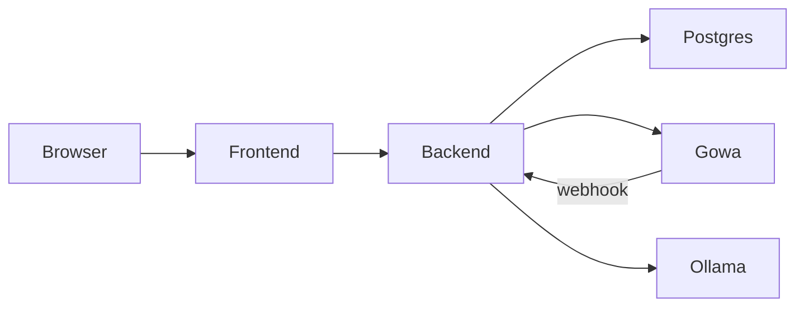

# Arquitectura

## Stack

| Capa | Tecnología |
|------|------------|
| Frontend | React 18, TypeScript, Vite, React Router |
| Backend | FastAPI, SQLModel, Pydantic v2 |
| Base de datos | PostgreSQL 16 |
| Mensajería | goWA (WhatsApp Web multidevice) |
| Firma PDF | pypdf, reportlab, Pillow |
| Correo | SMTP (`smtplib`) |
| IA (opcional) | Ollama |

## Multi-tenant

```
Tenant (cuenta de facturación / white-label)
 └── Company (empresa)
      └── WorkCenter (centro de trabajo)
           └── Department (departamento)
                └── Employee (empleado)
```

- Cada **tenant** puede tener varias empresas, branding y (en despliegues completos) contenedor goWA dedicado.
- El **contexto activo** en el panel cliente se envía en cabeceras HTTP:
  - `X-Company-Id`
  - `X-Work-Center-Id`
  - `X-Department-Id`

El selector de organización (`OrgSelector`) persiste estos valores en `localStorage`.

## Autenticación

| Tipo | Login | Token |
|------|-------|-------|
| Usuario plataforma | `/acceso` (email) | JWT plataforma |
| Usuario tenant | `/acceso` (cuenta + código + contraseña) | JWT tenant |

Rutas protegidas:

- `/admin/*` → `PlatformProtectedRoute`
- `/app/*` → `ProtectedRoute` + permisos por módulo (`canModule`)

## Permisos (RBAC)

Los **grupos** del tenant agrupan permisos (`read`, `write`, `admin`) por módulo: `employees`, `clock_ins`, `documents`, `legal`, `signatures`, etc.

Al crear empleados con rol administrativo, se asignan grupos por defecto vía `assign_role_default_group`.

## Servicios backend relevantes

| Servicio | Responsabilidad |
|----------|-----------------|
| `signature_service` | Envelopes, OTP, PDF firmado |
| `signature_notify` | WhatsApp + email en flujo de firma |
| `mail_service` | SMTP global + `mail_logs` |
| `gowa_service` | Envío WhatsApp |
| `legal_service` | Documentos legales y aceptaciones |
| `work_schedule` | Validación bloques de horario |
| `settings_service` | `system_settings` (goWA, SMTP, Ollama) |

## Almacenamiento de ficheros

Volumen Docker `uploads_data` montado en `/app/uploads`:

```
uploads/
├── {uuid}_{nombre}.pdf          # Documentos generales
└── firma/
    ├── staging/                 # Originales de envelopes
    └── envelope-{id}/
        ├── signatures/          # PNG firmas manuscritas
        ├── *_signed.pdf
        └── *_cert.pdf
```

## WhatsApp

- **Plataforma**: un goWA compartido (`hrm-gowa`) configurado en `/admin/whatsapp`.
- **Por tenant** (modo avanzado): contenedor `hrm-gowa-{slug}` creado desde el panel de cuenta; webhook `POST /webhook/whatsapp/{slug}`.

El webhook procesa mensajes (fichajes, vacaciones, etc.) vía `webhook_service` y Ollama cuando está disponible.

## Diagrama de despliegue (Docker Compose)


