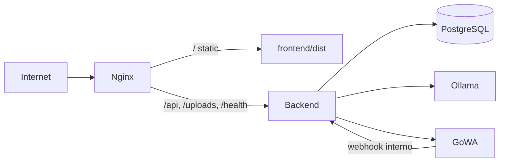

# Despliegue en servidor (producción)

Guía para migrar **HRM** desde el entorno de desarrollo Docker a un servidor Linux (VPS, VM o bare metal) con HTTPS, copias de seguridad y WhatsApp operativo.

Para desarrollo local, ver [Instalación y arranque](instalacion.md).

---

## 1. Arquitectura recomendada



| Componente | En producción |
|------------|----------------|
| **Nginx** | Termina SSL, sirve el build estático del frontend y hace proxy al API |
| **Backend** | FastAPI en Docker, solo escucha en `127.0.0.1:8000` |
| **PostgreSQL** | Solo red Docker interna (sin puerto público) |
| **goWA** | WhatsApp; puerto `3000` enlazado a `127.0.0.1` (QR / admin por túnel SSH) |
| **Ollama** | Opcional pero recomendado si usas IA por WhatsApp |

El frontend ya llama a la API con rutas relativas (`/api`), así que con Nginx en el mismo dominio **no hace falta tocar CORS** en `main.py`.

---

## 2. Requisitos del servidor

- **SO**: Ubuntu 22.04/24.04 LTS (o Debian equivalente)
- **RAM**: mínimo 4 GB (8 GB si activas Ollama + modelo `llama3.2`)
- **Disco**: 20 GB+ (más si guardas muchos documentos en `uploads`)
- Software:
  - [Docker Engine](https://docs.docker.com/engine/install/) + plugin Compose v2
  - **Nginx**
  - **Certbot** (Let's Encrypt) o certificado propio
  - **Bun** (solo en el host para compilar el frontend), o compilar en CI y subir `dist/`

Puertos expuestos a Internet:

| Puerto | Uso |
|--------|-----|
| 80 / 443 | Nginx (HTTP → redirección HTTPS) |
| 22 | SSH (restringir por IP si es posible) |

**No** expongas `5432`, `8000` ni `11434` a Internet. goWA (`3000`) solo en localhost o VPN.

---

## 3. Preparar el servidor

### 3.1 Usuario y directorio

```bash
sudo adduser hrm --disabled-password
sudo usermod -aG docker hrm
sudo mkdir -p /opt/hrm
sudo chown hrm:hrm /opt/hrm
```

Como usuario `hrm`:

```bash
cd /opt/hrm
git clone <URL_DEL_REPOSITORIO> .
```

### 3.2 Variables de entorno

```bash
cp .env.example .env
nano .env
```

Valores **obligatorios** en producción:

| Variable | Ejemplo producción | Notas |
|----------|-------------------|--------|
| `POSTGRES_PASSWORD` | cadena larga aleatoria | No reutilizar `hrm_secret` |
| `JWT_SECRET` | 64+ caracteres aleatorios | Rotar invalida sesiones |
| `PUBLIC_APP_URL` | `https://hrm.tudominio.com` | Enlaces de firma, incidencias, Stripe |
| `GOWA_BASIC_AUTH` | `usuario:contraseña_fuerte` | Panel goWA en `:3000` |
| `PLATFORM_SETUP_KEY` | clave secreta | Alta inicial admin plataforma |
| `STRIPE_SIMULATION_MODE` | `false` | Si usas cobro real |
| `STRIPE_*` | claves live | Webhook Stripe → `https://hrm.tudominio.com/api/...` |

Opcional:

| Variable | Descripción |
|----------|-------------|
| `OLLAMA_MODEL` | Por defecto `llama3.2` |
| `GOWA_IMAGE` | Imagen goWA si cambias de versión |

---

## 4. Levantar servicios Docker (producción)

El repositorio incluye `docker-compose.prod.yml` (sin `--reload`, sin montar código fuente, PostgreSQL sin puerto público).

```bash
cd /opt/hrm
docker compose -f docker-compose.prod.yml --env-file .env up -d --build
```

Comprobar contenedores:

```bash
docker compose -f docker-compose.prod.yml ps
docker logs hrm-backend --tail 50
```

### 4.1 Modelo Ollama (primera vez)

```bash
docker exec hrm-ollama ollama pull llama3.2
```

Puede tardar varios minutos según ancho de banda.

### 4.2 Migraciones históricas (solo una vez)

El backend ejecuta migraciones recientes al arrancar (`main.py`). En bases **nuevas** clonadas desde cero, ejecuta también las históricas:

```bash
for m in migrate_multitenant migrate_rbac_billing migrate_org_hierarchy \
  migrate_company_billing migrate_pricing_catalog migrate_stripe \
  migrate_employee_constraints; do
  docker exec hrm-backend python -m scripts.$m
done
```

Si ves errores del tipo «column already exists», puedes ignorarlos (son idempotentes en la práctica).

### 4.3 Health check API

```bash
curl -s http://127.0.0.1:8000/health
```

Debe responder JSON con estado OK.

---

## 5. Build del frontend

En el servidor (con Bun instalado):

```bash
cd /opt/hrm/frontend
bun install --frozen-lockfile
bun run build
```

Copia los estáticos a la ruta que usará Nginx:

```bash
sudo mkdir -p /var/www/hrm/frontend
sudo rsync -a dist/ /var/www/hrm/frontend/dist/
sudo chown -R www-data:www-data /var/www/hrm
```

**Alternativa sin Bun en el servidor**: compilar en tu máquina o en CI y subir solo la carpeta `frontend/dist` por `rsync` o `scp`.

**Alternativa Docker** (generar `dist` en contenedor):

```bash
cd /opt/hrm/frontend
docker build -f Dockerfile.prod -t hrm-frontend-build .
docker create --name hrm-fe-tmp hrm-frontend-build
docker cp hrm-fe-tmp:/dist ./dist
docker rm hrm-fe-tmp
sudo rsync -a dist/ /var/www/hrm/frontend/dist/
```

Tras cada despliegue de código frontend, repite `bun run build` y `rsync`.

---

## 6. Nginx + HTTPS

Copia y adapta el ejemplo:

```bash
sudo cp /opt/hrm/deploy/nginx-hrm.conf.example /etc/nginx/sites-available/hrm
sudo nano /etc/nginx/sites-available/hrm
# Cambiar hrm.tudominio.com y rutas ssl_certificate
sudo ln -s /etc/nginx/sites-available/hrm /etc/nginx/sites-enabled/
sudo nginx -t
```

Certificado Let's Encrypt:

```bash
sudo certbot --nginx -d hrm.tudominio.com
sudo systemctl reload nginx
```

El ejemplo proxy:

- `/` → `frontend/dist` (SPA, `try_files` → `index.html`)
- `/api/` → backend `127.0.0.1:8000`
- `/uploads/` → ficheros subidos
- `/webhook/` → webhooks (p. ej. Stripe si los configuras en esa ruta)
- `/health` → comprobación del backend

Prueba en el navegador: `https://hrm.tudominio.com` y `https://hrm.tudominio.com/health`.

---

## 7. WhatsApp (goWA)

### 7.1 Conexión inicial (QR)

goWA escucha en `127.0.0.1:3000` en el servidor. Desde tu PC:

```bash
ssh -L 3000:127.0.0.1:3000 hrm@IP_DEL_SERVIDOR
```

Abre en el navegador `http://localhost:3000`, autentica con `GOWA_BASIC_AUTH` y escanea el QR.

### 7.2 Webhook

En `docker-compose.prod.yml` el webhook ya apunta a la red interna:

`WHATSAPP_WEBHOOK=http://backend:8000/webhook/whatsapp`

No necesitas exponer el webhook a Internet si goWA y el backend comparten la red Docker `hrm-net`.

### 7.3 Enlace en admin plataforma

En el panel **Admin → WhatsApp**, configura la URL/base del servicio goWA según cómo accedas (túnel o dominio interno). La documentación de permisos e IA está en [AI_WHATSAPP.md](AI_WHATSAPP.md).

---

## 8. Stripe (opcional)

1. `PUBLIC_APP_URL=https://hrm.tudominio.com`
2. `STRIPE_SIMULATION_MODE=false` y claves live en `.env`
3. En el dashboard Stripe, webhook apuntando a la ruta que exponga tu API (revisa rutas en `backend/app/routers` / documentación Stripe del proyecto)
4. Reinicia backend tras cambiar `.env`:

```bash
docker compose -f docker-compose.prod.yml --env-file .env up -d backend
```

---

## 9. Copias de seguridad

### 9.1 Base de datos

```bash
docker exec hrm-postgres pg_dump -U hrm -Fc hrm > /backup/hrm_$(date +%F).dump
```

Restaurar:

```bash
cat backup.dump | docker exec -i hrm-postgres pg_restore -U hrm -d hrm --clean --if-exists
```

### 9.2 Ficheros subidos

Los documentos están en el volumen Docker `uploads_data`:

```bash
docker run --rm -v hrm_uploads_data:/data -v /backup:/backup alpine \
  tar czf /backup/hrm_uploads_$(date +%F).tar.gz -C /data .
```

Programa `cron` diario para ambos y copia off-site (S3, otro servidor).

### 9.3 Sesión WhatsApp (goWA)

```bash
docker run --rm -v hrm_gowa_data:/data -v /backup:/backup alpine \
  tar czf /backup/hrm_gowa_$(date +%F).tar.gz -C /data .
```

---

## 10. Actualizar a una nueva versión

```bash
cd /opt/hrm
git pull

# Backend + servicios
docker compose -f docker-compose.prod.yml --env-file .env up -d --build

# Frontend
cd frontend && bun install && bun run build
sudo rsync -a dist/ /var/www/hrm/frontend/dist/

# Migraciones manuales solo si el README/release lo indica
docker logs hrm-backend --tail 100
```

---

## 11. Seguridad (checklist)

- [ ] `.env` con permisos `600`, fuera de git
- [ ] Contraseñas y `JWT_SECRET` únicos por entorno
- [ ] Firewall: solo 22, 80, 443 (ufw o security group cloud)
- [ ] PostgreSQL y Ollama **sin** puerto público
- [ ] goWA solo en `127.0.0.1:3000` o VPN
- [ ] HTTPS obligatorio (`PUBLIC_APP_URL` con `https://`)
- [ ] Backups automáticos probados con restauración de prueba
- [ ] Desactivar credenciales demo en producción o cambiar contraseñas
- [ ] `STRIPE_SIMULATION_MODE=false` solo cuando Stripe esté configurado
- [ ] Revisar logs: `docker logs hrm-backend`, `journalctl -u nginx`

---

## 12. Solución de problemas

| Síntoma | Qué revisar |
|---------|-------------|
| Login «error de red» | Nginx proxy `/api/`; `curl http://127.0.0.1:8000/health` |
| Enlaces de firma/incidencia rotos | `PUBLIC_APP_URL` debe ser la URL HTTPS real |
| WhatsApp no responde | `docker logs hrm-gowa`; sesión QR; webhook en logs del backend |
| IA no entiende mensajes | `docker exec hrm-ollama ollama list`; modelo descargado |
| 413 en subida de archivos | `client_max_body_size` en Nginx (ejemplo: 25M) |
| CORS en otro dominio API | Mejor unificar dominio con Nginx; si no, añade el origen en `backend/app/main.py` |

### Logs útiles

```bash
docker logs -f hrm-backend
docker logs -f hrm-gowa
docker logs -f hrm-postgres
sudo tail -f /var/log/nginx/error.log
```

---

## 13. Referencia de ficheros

| Fichero | Uso |
|---------|-----|
| `docker-compose.prod.yml` | Stack producción |
| `deploy/nginx-hrm.conf.example` | Plantilla Nginx |
| `frontend/Dockerfile.prod` | Build estático en contenedor |
| `.env.example` | Plantilla de variables |

Desarrollo sigue usando `docker compose up` (sin `-f docker-compose.prod.yml`).
