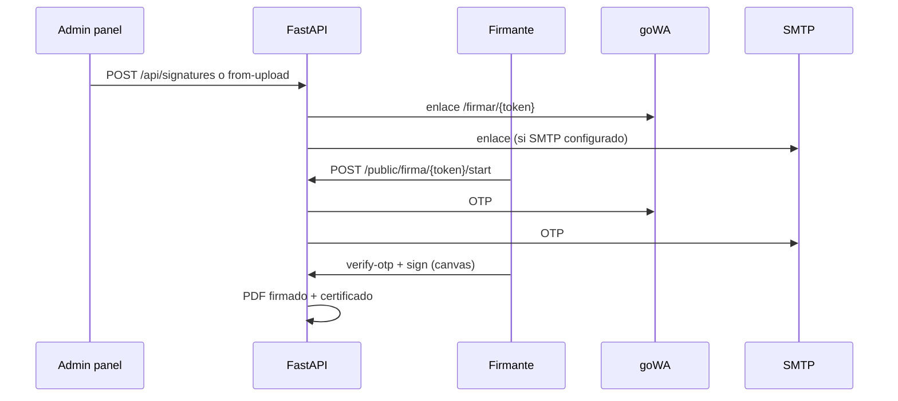

# Firmas electrónicas

Implementación FastAPI/React de alcurro. La especificación original (Laravel) está en [`firmas.md`](../firmas.md) en la raíz del repo.

## Visión general



## Panel (`/app/firmas`)

### Crear solicitud

1. **Documento**: subir PDF/archivo o elegir uno de la biblioteca.
2. **Título** de la solicitud.
3. **Firmantes** (orden de firma):
   - **Firmante externo** (por defecto): nombre, DNI/NIE, teléfono, email opcional.
   - **Empleado**: selección del listado (opcional).

No es obligatorio que ningún firmante sea empleado. Al subir un archivo nuevo, el documento se asocia a la **empresa activa** (`company_id`), no a un empleado titular.

### Estados del envelope

| Estado | Descripción |
|--------|-------------|
| `borrador` | Creado sin enviar |
| `enviado` | Notificaciones enviadas |
| `parcial` | Algunos firmantes han firmado |
| `completado` | Todos firmaron; PDF y certificado disponibles |
| `cancelado` | Cancelado con motivo |
| `expirado` | Pasó `expires_at` |

### Acciones

- Descargar PDF firmado y certificado (si `completado`).
- Reenviar enlace a firmante pendiente.
- Cancelar con motivo.

## Página pública (`/firmar/:token`)

Sin login. Flujo:

1. Validar **DNI/NIE** (+ email/teléfono si están registrados en el firmante).
2. Recibir **OTP** por WhatsApp y/o email.
3. Verificar OTP.
4. Firmar en canvas (`SignatureCanvas`).
5. Al completar todos los firmantes → generación de PDF.

## Modelos (PostgreSQL)

| Tabla | Descripción |
|-------|-------------|
| `signature_envelopes` | Solicitud: referencia `FRM-YYYYMMDD-HHMMSS`, hash original, rutas PDF |
| `signature_signers` | Firmante, token, OTP, imagen firma, IP/UA |
| `signature_otps` | Códigos activos (10 min, máx. intentos) |
| `signature_events` | Auditoría encadenada |
| `signature_notifications` | Log por canal (whatsapp/email) |

`document_deliveries` puede tener `employee_id` nulo y `company_id` para documentos subidos solo para firma.

## API

### Protegida (JWT tenant, permiso `documents`)

| Método | Ruta | Función |
|--------|------|---------|
| GET | `/api/signatures` | Listar envelopes |
| POST | `/api/signatures` | Crear desde `document_delivery_id` |
| POST | `/api/signatures/from-upload` | Multipart: `file`, `signers_json`, `title`, … |
| POST | `/api/signatures/{id}/cancel` | Cancelar |
| POST | `/api/signatures/{id}/signers/{sid}/resend` | Reenviar |
| GET | `/api/signatures/{id}/signed` | Descargar PDF firmado |
| GET | `/api/signatures/{id}/certificate` | Descargar certificado |

### Pública

Prefijo: `/api/public/firma/{token}`

| Método | Ruta |
|--------|------|
| GET | `...` | Metadatos |
| POST | `.../start` | Validar identidad → OTP |
| POST | `.../verify-otp` | Verificar código |
| POST | `.../sign` | Imagen firma base64 |

Variable de entorno `PUBLIC_APP_URL` define la base del enlace (`https://tudominio/firmar/{token}`).

## Firmantes

Payload por firmante (JSON):

```json
// Empleado
{ "employee_id": "uuid", "sign_order": 1 }

// Externo
{
  "full_name": "Ana García",
  "id_document": "12345678Z",
  "phone": "600000000",
  "email": "ana@ejemplo.com",
  "sign_order": 2
}
```

## Archivos generados

Bajo `/app/uploads/firma/`:

- `envelope-{id}/signatures/signer-{id}.png`
- PDF firmado con sellos y metadatos
- Certificado PDF + JSON de cumplimiento

Servicios: `signature_pdf.py`, `signature_audit.py`, `signature_notify.py`.

## Notificaciones

| Evento | Canales |
|--------|---------|
| Solicitud | WhatsApp + email |
| OTP | WhatsApp + email |
| Completada | WhatsApp (email según implementación) |
| Cancelada | WhatsApp |

Requiere goWA vinculado y/o [SMTP configurado](correo-smtp.md).

## Migración

`scripts/migrate_signatures.py` — tablas de firma. Se ejecuta al arrancar el backend.
