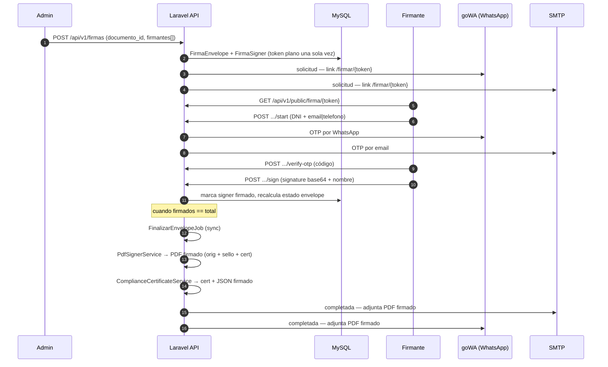

# Firma electrónica — Puerta Sevilla Inmobiliaria

Flujo completo de firma de documentos: creación de envelope, autenticación del firmante por OTP, captura de firma manuscrita, generación del PDF firmado con sello y certificado, y notificación a los firmantes por email/WhatsApp.

> Reemplaza el camino "Firmafy" del ADR-001. Hoy el sistema opera 100 % in-house: la integración con Firmafy queda como opción futura para firmas avanzadas/cualificadas externas.

## Visión general



## Modelos y almacenamiento

| Tabla | Modelo | Resumen |
|---|---|---|
| `firma_envelopes` | `FirmaEnvelope` | Una solicitud de firma sobre un `Documento`. Estados: borrador → enviado → parcial → completado / cancelado / expirado. |
| `firma_signers` | `FirmaSigner` | Un firmante. Token hasheado, OTP, IP/UA, imagen firma. |
| `firma_otps` | `FirmaOtp` | Códigos OTP emitidos (válidos N min, intentos limitados). |
| `firma_events` | `FirmaEvent` | Cadena de auditoría con hash encadenado por envelope. |
| `firma_notifications` | `FirmaNotification` | Registro de cada notificación enviada por cada canal. |

Archivos en disco (`storage/app/private/`):

| Path | Contenido |
|---|---|
| `documentos/<hash>.<ext>` | Original cargado por el admin desde la app o WhatsApp. |
| `firma/signatures/envelope-{E}-signer-{S}.png` | Imagen manuscrita capturada en el canvas del firmante. |
| `firma/signed/envelope-{E}_signed.pdf` | PDF firmado completo (original + sellos + certificado). |
| `firma/certificates/envelope-{E}_cert.pdf` + `.json` | Certificado de cumplimiento independiente. |

## Endpoints

### Privados (Sanctum, rol administrador)

| Método | Path | Función |
|---|---|---|
| `GET` | `/api/v1/firmas` | Listar envelopes con filtros. |
| `POST` | `/api/v1/firmas` | Crear envelope a partir de `documento_id` + firmantes. |
| `POST` | `/api/v1/firmas/{e}/cancel` | Cancelar con motivo. |
| `POST` | `/api/v1/firmas/{e}/signers/{s}/resend` | Regenerar token y reenviar al firmante. |
| `GET` | `/api/v1/firmas/{e}/signed` | Descargar PDF firmado completo. |
| `GET` | `/api/v1/firmas/{e}/certificate` | Descargar certificado independiente. |

### Públicos (URL token + OTP, **sin CSRF**)

Excluidos de CSRF en [`bootstrap/app.php`](../apps/api/bootstrap/app.php) (`validateCsrfTokens(except: ['api/v1/public/*'])`) porque la autenticación es por token de URL + OTP, no por sesión.

| Método | Path | Función |
|---|---|---|
| `GET` | `/api/v1/public/firma/{token}` | Metadatos del envelope (nombre, hint email/teléfono). |
| `POST` | `/api/v1/public/firma/{token}/start` | Validar DNI + email/teléfono → emite OTP. |
| `POST` | `/api/v1/public/firma/{token}/verify-otp` | Verifica el código y marca al signer como autenticado. |
| `POST` | `/api/v1/public/firma/{token}/sign` | Recibe imagen firma + acepto y deja al signer firmado. |
| `GET` | `/api/v1/public/firma/{token}/download-signed` | Descarga el PDF firmado tras completarse. |

Throttle global: `throttle:30,1` (30 req/min por IP).

## Generación del PDF firmado

[`PdfSignerService::generarPdfFirmado`](../apps/api/app/Services/Firma/PdfSignerService.php) construye el PDF final usando **mpdf + FPDI**:

1. Importa página a página el documento original (PDF) con `setSourceFile` + `importPage` + `useTemplate`, conservando tamaño y orientación. Si el original es una imagen (jpg/png/gif/webp), la embebe como primera página.
2. Estampa un **sello vertical azul** en el lateral izquierdo de cada página del original, con `Rotate(90, …)` + `Rect` + `Text`. El sello incluye:
   - Nombre de empresa (`config('app.name')` → ver [Configuración dinámica](#configuración-dinámica-desde-ajustes)).
   - Referencia del envelope (`FRM-YYYYMMDD-XXXXXX`).
   - Por cada firmante: nombre · fecha/hora · IP.
   - Primeros 16 caracteres del hash SHA-256 del original.
3. Añade al final el certificado renderizado desde [`resources/views/pdf/firma/signed.blade.php`](../apps/api/resources/views/pdf/firma/signed.blade.php) (tabla resumen + imágenes manuscritas de cada firmante).

### Sello

Banda en `azul (#1E40AF)`, fuente DejaVu 6.5 pt, ancho 5.5 mm, leyendo de abajo a arriba (texto rotado +90°). `autoPageBreak` se apaga durante el dibujo del sello para que `Rect`/`Text` no disparen un salto de página (problema histórico que multiplicaba x2 las páginas del documento original).

Si el original está vacío (0 bytes) o mpdf no consigue importarlo, se loguea como `warning` y el envelope queda únicamente con la página de certificado. **Las subidas y la creación de envelopes ya rechazan documentos de 0 bytes** ([`DocumentoController::store`](../apps/api/app/Http/Controllers/Api/V1/DocumentoController.php), [`EnvelopeService::crearDesdeDocumento`](../apps/api/app/Services/Firma/EnvelopeService.php)).

## Notificaciones

[`FirmaNotifier`](../apps/api/app/Services/Firma/Notifications/FirmaNotifier.php) emite cada evento por todos los canales habilitados; cada envío deja fila en `firma_notifications`.

Canales:

| Canal | Clase | Uso |
|---|---|---|
| Email | [`EmailFirmaChannel`](../apps/api/app/Services/Firma/Notifications/EmailFirmaChannel.php) | `Mail::raw` con adjuntos (`$message->attach`). |
| WhatsApp | [`WhatsAppFirmaChannel`](../apps/api/app/Services/Firma/Notifications/WhatsAppFirmaChannel.php) | Texto vía goWA; si hay `adjunto_path` usa `sendMediaFromPath` para subir el PDF. |

Eventos:

| Evento | Cuándo | Adjunto |
|---|---|---|
| `solicitud` | Al crear el envelope. | — |
| `recordatorio` | Cron diario para firmantes pendientes. | — |
| `completada` | En [`FinalizarEnvelopeJob`](../apps/api/app/Jobs/Firma/FinalizarEnvelopeJob.php) cuando todos firman. | PDF firmado (`{ref}_signed.pdf`). |
| `cancelada` | Cancelación manual. | — |

Plantillas en [`config/firma.php`](../apps/api/config/firma.php) con variables `{{ firmante }}`, `{{ empresa }}`, `{{ documento }}`, `{{ envelope_ref }}`, `{{ enlace }}`, `{{ codigo }}`, `{{ expira }}`.

## Configuración dinámica desde Ajustes

Tres bloques de `app_settings` se aplican automáticamente en cada request vía [`AppServiceProvider::boot`](../apps/api/app/Providers/AppServiceProvider.php):

| Grupo Ajustes | Origen | Lo que sobreescribe en runtime |
|---|---|---|
| `mail.*` | Ajustes → Correo | `mail.default = smtp` + credenciales SMTP + `mail.from.address` / `mail.from.name`. |
| `display.empresa_nombre` | Ajustes → Display | `config('app.name')`. Se usa en asunto/firma de emails, cabecera del PDF firmado, cabecera del certificado y sello vertical de cada página del PDF. |
| `whatsapp.*` | Ajustes → WhatsApp | URL y token de la instancia goWA. |

Antes era necesario relanzar el contenedor tras cambiar SMTP en BBDD; ahora basta con guardar en Ajustes y la siguiente request lo aplica.

> El cambio de `app.name` también afecta a Redis/cache/session keys porque los defaults de Laravel los derivan de `APP_NAME`. Para evitar invalidaciones masivas tras renombrar la empresa, esos defaults siguen leyendo de `env('APP_NAME')` (no de `config('app.name')` en runtime).

## CSRF y rutas públicas

El SPA y el endpoint público comparten dominio (`app.puertasevillainmobiliaria.online`), incluido en `SANCTUM_STATEFUL_DOMAINS`. Sanctum interpretaba esto como petición stateful → exigía `X-XSRF-TOKEN` → 419 al hacer POST `verify-otp`/`sign`. Se excluye explícitamente el prefijo público de CSRF en [`bootstrap/app.php`](../apps/api/bootstrap/app.php):

```php
$middleware->validateCsrfTokens(except: [
    'api/v1/public/*',
]);
```

Es seguro porque la autenticación es por token de URL de un solo uso + OTP, no por cookie de sesión.

## Operativa

### Reenviar el link a un firmante
- Botón "Reenviar" en Firmas → genera token nuevo, invalida el anterior, manda email+WhatsApp.

### Regenerar el PDF firmado de un envelope ya completado
El `FinalizarEnvelopeJob` tiene un `early-return` si `signed_path` y `certificate_path` ya existen. Para forzar la regeneración (p. ej. tras un cambio en el sello/cert):

```bash
docker exec puertasevilla-api-1 php artisan tinker --execute="
  foreach(App\Models\Firma\FirmaEnvelope::where('estado','completado')->get() as \$e){
    \$r = app(App\Services\Firma\PdfSignerService::class)->generarPdfFirmado(\$e);
    \$e->update(['signed_path'=>\$r['path'],'signed_hash'=>\$r['hash']]);
    echo \$e->ref,' → ',\$r['path'],PHP_EOL;
  }"
```

### Cancelar un envelope
`POST /api/v1/firmas/{id}/cancel` con `{ "motivo": "..." }`. Los signers pendientes pasan a `expirado` y se notifica como `cancelada`.

### Comprobar la integridad del original
El hash SHA-256 del original se guarda en `firma_envelopes.original_hash` al crear el envelope. Para verificar a posteriori:

```bash
sha256sum storage/app/private/<original_path>
# Comparar con la columna `original_hash` y con los primeros 16 chars que aparecen en el sello.
```

## Migración de documentos legacy

Los documentos del sistema viejo (`legacy/files/{id}.{ext}`) se importan idempotentemente con `php artisan legacy:import --only=documentos` ([`LegacyImportCommand`](../apps/api/app/Console/Commands/LegacyImportCommand.php)). El comando:

- Solo copia el binario si el origen existe y tiene tamaño > 0.
- No crea placeholders de 0 bytes (que reventaban el visor PDF y la firma).
- Reconcilia filas existentes buscando por `path LIKE 'documentos/legacy/{id}.%'` para no duplicar al cambiar extensión.

Se puede relanzar cuantas veces haga falta a medida que llegan ficheros del servidor antiguo: ejecuciones sucesivas solo rellenan los huecos.
